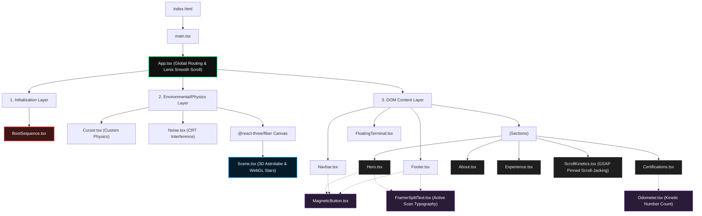

# Codebase Architecture Graph

Here is the architectural topology of your DevSecOps portfolio. It outlines the DOM hierarchy, rendering pipelines, and component relationships, separating standard React rendering from your WebGL/GSAP engines.

## Matrix Breakdown
* **Initialization Layer (Red)**: Handles absolute system mount and loading. Completely blocks execution of physics until booted.
* **Physics & WebGL Layer (Blue/Green)**: Houses raw Three.js nodes (`Scene.tsx`) and persistent DOM overlays (`Cursor`, `Noise`). Locked underneath the viewport.
* **Content Layer (Gray)**: Standard React component hierarchy that utilizes `Lenis` smooth scrolling and `GSAP` scrubbers to interact with the environment.
* **Primitive Engines (Purple)**: Highly reusable utility components driving typography and button kinetics across multiple parent sections.
